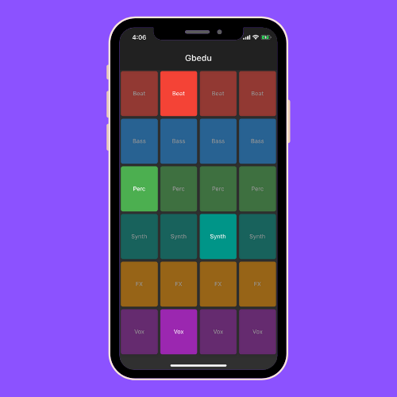

# Gbedu

Gbedu is an app that allows anyone to create afrobeats on their mobile device.

## 📸 Screenshot

## 🔔 Prerequisites
Before you begin, ensure you have met the following requirements:
* Installed Flutter SDK on MacOS X, Linux, Windows (https://flutter.dev/docs/get-started/install)
* Installed one of the following Code editors Android Studio (recommended), VSCode, IntelliJ.
* Installed Flutter and Dart Plugins (https://flutter.dev/docs/get-started/editor)

## 🎛 Contributing to Gbedu
To contribute to Gbedu, follow these steps:
1. Fork this repository.
2. Create a branch: `git checkout -b <branch_name>`.
3. Make your changes and commit them: `git commit -m '<commit_message>'`
4. Push to the original branch: `git push origin <project_name>/<location>`
5. Create the pull request.

Alternatively see the GitHub documentation on creating a pull request.